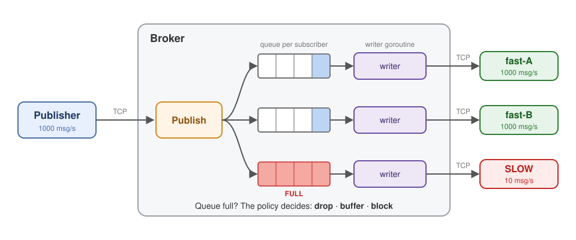

# go_pub_sub: When Subscribers Can't Keep Up

A small publish/subscribe message broker in Go, built to answer one question:

> **What happens if producers send messages faster than consumers can process them?**

*Designing Data-Intensive Applications* names three options:

1. **Drop** messages
2. **Buffer** them in a queue
3. Apply **backpressure**: make the producer wait

This project implements all three and measures what each one costs.

## How it works



- Clients connect over **TCP** and send one command per line:
  `SUB <topic>`, `UNSUB <topic>`, `PUB <topic> <message>`.
  Subscribers receive `MSG <topic> <message>`.
- Each connection gets a **goroutine** that reads its commands.
- Each subscriber has its **own queue** and its **own writer goroutine**. Only the
  writer waits on a slow socket.
- The **policy** decides what `Publish` does when a subscriber's queue is full.
  That decision is the whole talk.

## The three policies

All three live in [`broker/policy.go`](broker/policy.go).

| Policy | Go code | What happens when the queue is full |
|---|---|---|
| `drop` | `select { case ch <- msg: default: }` | The new message is thrown away for that subscriber |
| `buffer` | `items = append(items, msg)` | The queue just grows. There's no limit |
| `block` | `ch <- msg` | The publisher waits until there's room |

**Drop** and **block** differ by a single `select` with `default`.

## Run the demo

```bash
go run ./cmd/broker -policy drop        # terminal 1: or buffer, or block
go run ./experiments/slow-consumer      # terminal 2: live dashboard
```

The demo starts one publisher (1000 msg/s), two fast subscribers, and one slow
subscriber that takes 100ms per message (10 msg/s). Every second it shows each
one's rate, what the broker dropped or queued, latency, and broker memory.

Useful flags: `-rate 2000`, `-slow-delay 50ms`, `-fast 3`, `-duration 60s`.
The broker's stats are also at <http://localhost:7778/stats>.

You can also try it by hand:

```bash
nc localhost 7777     # then type: SUB dogs
nc localhost 7777     # then type: PUB dogs hello
```

## Results

12-second runs, 1000 msg/s, two fast subscribers, one slow at 10 msg/s:

| Policy | Publisher | Fast subscribers | Slow subscriber | Broker memory |
|---|---|---|---|---|
| **drop** | 1000 msg/s | 100% received, <1ms | **8,012 dropped** | flat |
| **buffer** | 1000 msg/s | 100% received, <1ms | 0 lost, **9,036 waiting** | **grows** |
| **block** | **~520 msg/s** | **only 61%, frozen** | 0 lost | flat |

| | Drop | Buffer | Block (backpressure) |
|---|---|---|---|
| Messages lost? | **Yes** | No | No |
| Memory | Flat | **Grows without limit** | Flat |
| Publisher slowed down? | No | No | **Yes** |
| Other subscribers affected? | No | No | **Yes, they freeze too** |
| Good for | Live data where only the latest matters (prices, metrics) | Short bursts | When every message must arrive |

### Benchmark

```bash
go test -bench . ./experiments/benchmarks
```

Cost of one `Publish` to 3 subscribers that all keep up (Apple M1 Pro):

| Policy | Time per publish | Dropped |
|---|---|---|
| drop | ~400 ns | ~33% (varies per run) |
| buffer | ~320 ns | 0 |
| block | ~1000 ns | 0 |

`buffer` looks fastest only because it never waits. Publishing quickly doesn't
mean messages are delivered quickly; it means they're piling up in memory.
And under `drop`, even fast subscribers lose messages when the publisher is an
in-memory loop with no pauses.

## What surprised me

1. **Nothing broke at first.** For about 2 seconds everything looked fine. The
   operating system's TCP buffers quietly absorbed thousands of messages
   before the broker's own queue even filled. On macOS those buffers can grow
   to megabytes per connection.
2. **Dropping didn't make the slow subscriber's data fresh.** Under `drop`, SLOW
   still got messages about 10 seconds old. It first has to work through
   everything already sitting in its queue and in the TCP buffers.
3. **Backpressure spreads.** With `block`, one slow subscriber froze the
   publisher, and through it the fast subscribers too. No code made that
   happen on purpose; it's simply what a blocking send does.

## Tests

```bash
go test -race ./...
```

Covers the protocol, subscribe/publish/unsubscribe, cleanup when a client
disconnects, and one test per policy. Each policy test uses a subscriber that
never reads, so it can check what that policy promises.

## Limitations

This is a learning project, not a production broker:

- Messages live only in memory. If the broker restarts, they're gone.
- No delivery guarantees or acknowledgements, and no replay for late subscribers.
- Messages from one publisher arrive in order, but there's no ordering between different publishers.
- One broker process only, with no clustering.

## Project layout

```
cmd/broker/                 starts the broker (flags: -policy, -queue, -addr)
broker/
  broker.go                 accepts connections, handles SUB/UNSUB/PUB
  client.go                 one connection: its queue and writer goroutine
  topic.go                  a topic and its subscribers
  policy.go                 drop, buffer and block
  protocol.go               parses the text commands
  stats.go                  the /stats endpoint
experiments/
  slow-consumer/            the live demo
  benchmarks/               go test -bench
tests/                      end-to-end tests over real TCP
```
